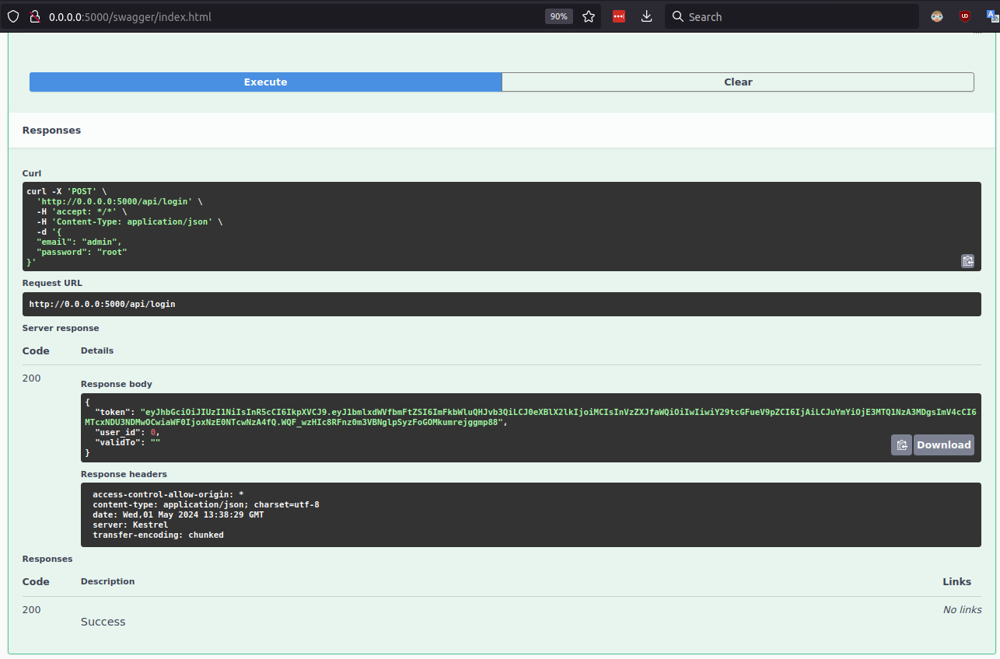
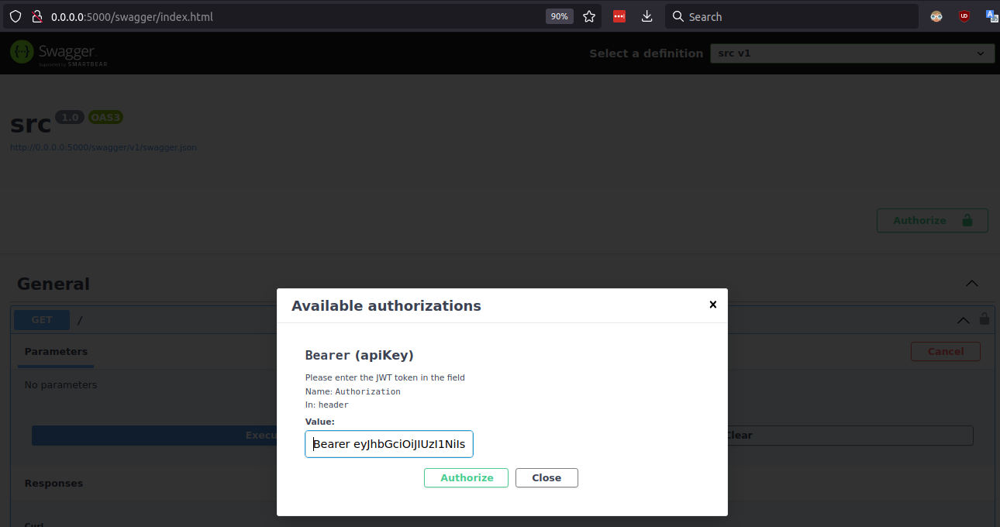
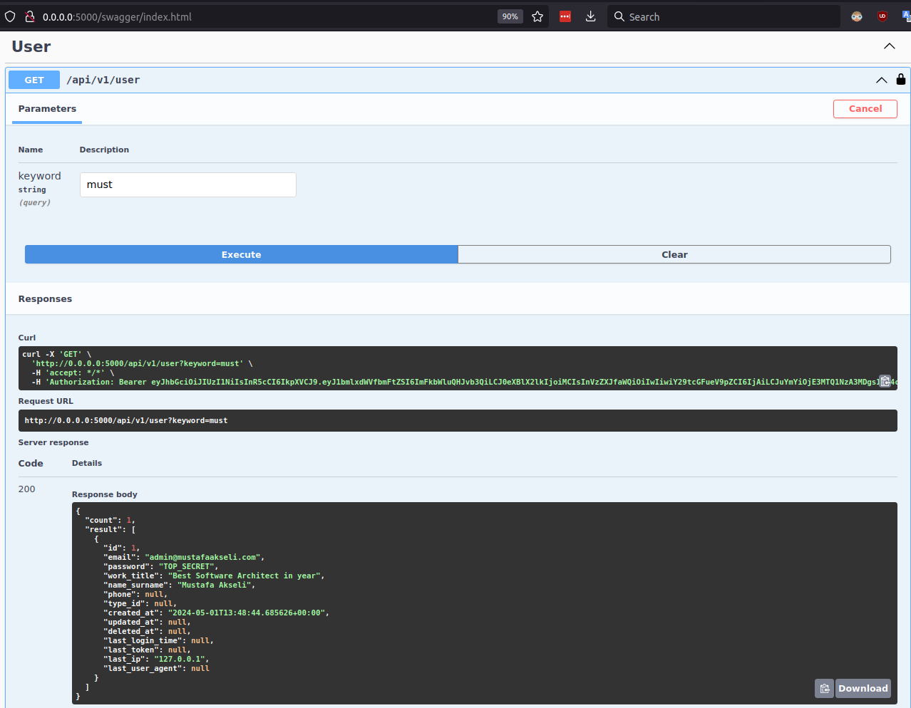

Introducing Dockerized .NET Core Web API showcasing the power of LINQ (Language Integrated Query) alongside robust features including user CRUD operations, secure login with JWT authentication, and integrated PostgreSQL and Redis support.

This project leverages LINQ to seamlessly query and manipulate data within the PostgreSQL database, enhancing development productivity and code readability.

Key Highlights:

-    User CRUD Operations: Effortlessly manage users with full Create, Read, Update, and Delete capabilities using LINQ for data operations.

-    Secure Login with JWT: Implementing JSON Web Tokens for secure user authentication, with LINQ for efficient user data retrieval.

-    PostgreSQL Integration: Utilizing LINQ with Entity Framework Core to interact with PostgreSQL, ensuring optimized database interactions.

-    Redis Caching: Leveraging Redis for efficient session management and caching, enhancing application performance with LINQ for data retrieval.

-    Containerized Deployment: Docker orchestration for seamless deployment across diverse environments, encapsulating LINQ-powered APIs within scalable Docker containers.

This project epitomizes modern web development practices, harnessing LINQ's expressiveness alongside .NET Core, PostgreSQL, and Redis, all orchestrated within Docker containers for unparalleled scalability and resilience.

Experience the future of web APIs, meticulously crafted with LINQ, .NET Core, PostgreSQL, and Redis, harmonized within Docker containers for a truly dynamic and scalable application architecture.


--------------------- 
## FOR RUN STEPS
1. ```docker comopose up -d ``` # // or docker-compose up -d 

2. connect postgresql terminal

3. ``` sql 
    CREATE DATABASE "jwt-auth"   WITH OWNER "postgres"   ENCODING 'UTF8'; 
```

4. connect "jwt-auth" database

5. ``` sql 

    CREATE TABLE public.users (
        id bigint GENERATED ALWAYS AS IDENTITY NOT NULL,
        email varchar NOT NULL,
        "password" varchar NOT NULL,
        work_title varchar NULL,
        name_surname varchar NOT NULL,
        phone varchar NULL,
        type_id int NULL,
        created_at timestamp with time zone DEFAULT now() NOT NULL,
        updated_at timestamp with time zone DEFAULT NULL,
        deleted_at timestamp with time zone DEFAULT NULL,
        last_login_time timestamp with time zone DEFAULT NULL,
        last_token varchar NULL,
        last_token varchar NULL,
        last_ip varchar NULL,
    CONSTRAINT users_pk PRIMARY KEY (id));
```


-- TODO --
- [x] Postgresql Integration
- [x] User Crud 
- [x] User Login & Jwt Auth
- [x] Redis Connection & Set token key
- [x] Docker Integration
- [x] Config moving appsettings.json to docker environment
- [ ] Write endpoint: List session user from redis
- [ ] Control Jwt middleware user session from /api/v1/.. endpoints


## SS
First Login


Api Key set Header


Search & List User
